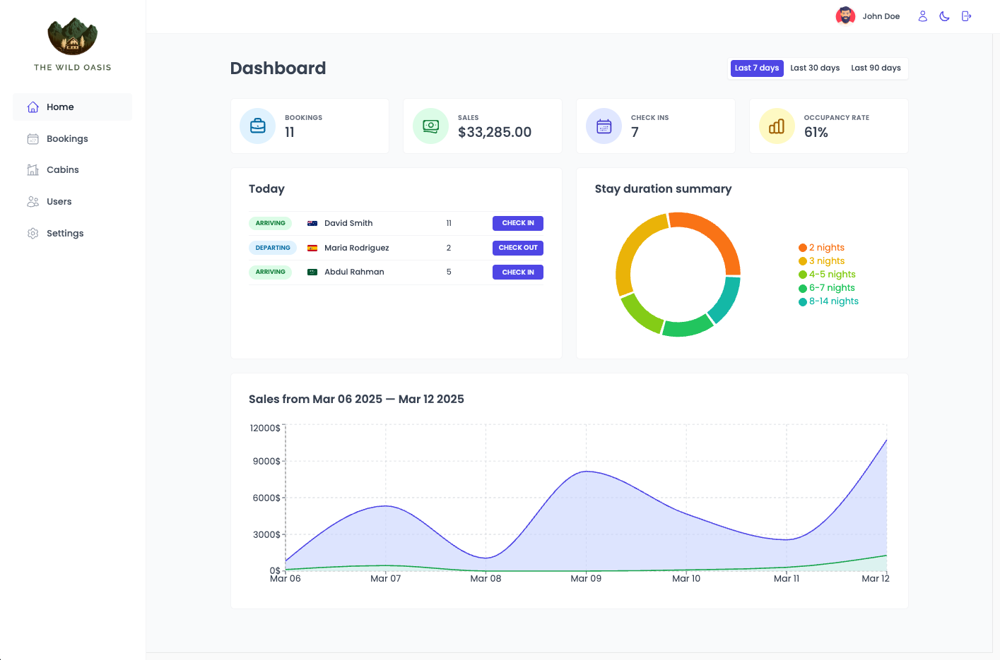

# The Wild Oasis



## Overview

A comprehensive internal hotel management application built with **React** that handles bookings, cabins, check-ins, and guests for "The Wild Oasis", a boutique hotel with 8 luxurious wooden cabins.

🏨 **Key Features:**

- **User Authentication:** Secure employee login system with account management
- **Cabin Management:** Add, edit, and delete cabins with photo uploads
- **Booking System:** Complete booking management with filtering options
- **Check-in/Check-out System:** Streamlined guest processing with payment confirmation
- **Dashboard:** Real-time statistics and daily operations overview
- **Dark Mode:** Customizable appearance for user preference
- **Settings Management:** Configure application-wide parameters

---

## ✨ Features

- **Authentication & User Management:**

  - Secure login for hotel employees
  - In-app user registration (restricted to hotel staff)
  - Profile customization with avatar uploads
  - Password management

- **Cabin Management:**

  - Table view of all cabins with details (photos, capacity, pricing)
  - Complete CRUD operations for cabin data
  - Photo upload functionality

- **Booking System:**

  - Comprehensive table with filtering by booking status
  - Complete booking details (dates, guests, cabin info, pricing)
  - Status tracking (unconfirmed, checked in, checked out)

- **Check-in/Check-out Process:**

  - Streamlined guest arrival workflow
  - Payment confirmation integration
  - Last-minute breakfast addition option

- **Guest Management:**

  - Detailed guest profiles with personal information
  - National ID and nationality tracking with country flags

- **Dashboard & Analytics:**

  - Daily check-in/check-out lists
  - Statistics for various time periods (7, 30, 90 days)
  - Sales charts (total vs extras)
  - Stay duration analytics

- **Settings:**
  - Customizable application parameters
  - Dark/Light mode toggle
  - Booking rules configuration

---

## 🛠 Built With

- **React** - UI framework
- **React Router** - Routing management
- **Styled Components** - CSS-in-JS styling
- **React Query** - Remote state management
- **Context API** - UI state management
- **React Hook Form** - Form handling and validation
- **React Icons** - Icon library
- **React Hot Toast** - Toast notifications
- **Recharts** - Data visualization
- **date-fns** - Date manipulation
- **Supabase** - Backend and database

---

## 🧠 Advanced Patterns

This project implements several advanced React patterns:

- **Compound Component Pattern** - Creating flexible, expressive component APIs
- **Render Props Pattern** - Sharing code between components
- **Custom React Hooks** - Reusable stateful logic

---

## 📈 React Query Benefits

- **Cached Data Management** - Optimized data storage and retrieval
- **Automatic Loading & Error States** - Simplified UI state handling
- **Automatic Re-fetching** - Real-time data synchronization
- **Pre-fetching Capabilities** - Enhanced performance
- **Simplified Remote State Mutation** - Streamlined data updates

---

## 🚀 Live Demo

🔗 [The Wild Oasis](https://juliengdev-wildoasis.netlify.app/)

- login : johndoe@example.com
- password : pass1234

---

## 📦 Installation

Get started with these simple steps:

1. **Clone the repository**

   ```bash
   git clone [your-repo-url]
   cd the-wild-oasis
   ```

2. **Install dependencies**

   ```bash
   npm install
   ```

3. **Set up environment variables**

   Create a `.env` file with your Supabase credentials:

   ```
   VITE_SUPABASE_URL=your_supabase_url
   VITE_SUPABASE_ANON_KEY=your_supabase_anon_key
   ```

4. **Start development server**

   ```bash
   npm run dev
   ```

5. **Build for production**

   ```bash
   npm run build
   ```

---

## 🤝 Contributing

Contributions are welcome! Please feel free to submit a Pull Request.

1. Fork the Project
2. Create your Feature Branch (`git checkout -b feature/AmazingFeature`)
3. Commit your Changes (`git commit -m 'Add some AmazingFeature'`)
4. Push to the Branch (`git push origin feature/AmazingFeature`)
5. Open a Pull Request

---

## 👨‍💻 Author

- 🌐 **Portfolio** - [Julien Gilbert](https://juliengilbert.com/)
- 🏆 **GitHub** - [@juliengDev](https://github.com/juliengDev)
- 💼 **LinkedIn** - [Julien Gilbert](https://www.linkedin.com/in/julien-gilbert-reactjs/)

---

🎯 _Feel free to reach out if you have any questions or suggestions!_ 🚀
